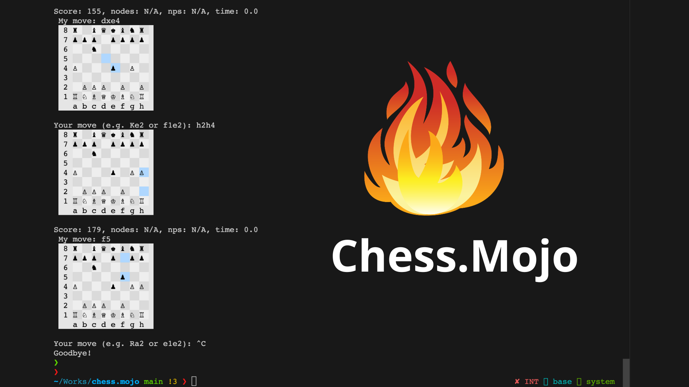

# Chess.Mojo 🔥

The first UCI chess engine in the Mojo language. (**WORK IN PROGRESS.**)



## Note

- The current engine is not optimized for speed. It is just a proof of concept.
- The source code was based on [sunfish](https://github.com/thomasahle/sunfish/).

## Roadmap

- [x] Basic UCI support.
- [x] Runable engine.
- [x] Integrate simple GUI for testing.
- [ ] Use native Mojo data structures for speed:
  - [ ] History.
  - [ ] Board hashing.
  - [ ] Move generation.
- [ ] Integrate NNUE.
- [ ] Multi-threading.
- [ ] Add Mojo GUI.

## Usage

- Install [Mojo](https://docs.modular.com/mojo/manual/get-started/).
- Run `mojo engine.mojo` to start the engine.

## Run with simple UI (In terminal)

- Install Python >= 3.8.
- Install required packages

```bash
pip install -r requirements.txt
```

- Start the GUI:

```bash
chmod +x ./engine.mojo
python play -cmd ./engine.mojo
```

**Note**: The engine can be run with any UCI compatible GUI. The simple UI is just for quick testing.

## Debugging

- Build the engine with full debug information:

```bash
mojo build --debug-level full engine.mojo
```

- Run the engine with `mojo debug` and use the console just like `gdb` or `lldb`:

```bash
mojo debug engine
```

## References

- This chess engine is based on [sunfish](https://github.com/thomasahle/sunfish/).
